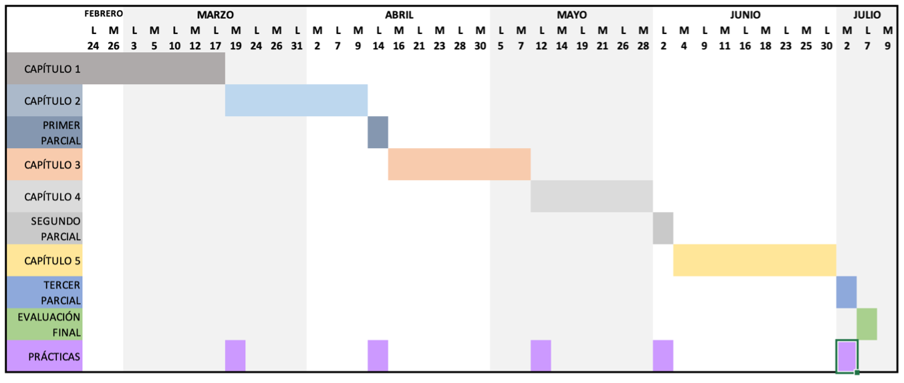

# Verificación y Validación de Software 

**Carrera:** Ingeniería Informática  
**Sigla y Código:** INF 732  
**Semestre:** 01-2025  
**Docente:** M.Sc. Lic. Huáscar Fedor Gonzales Guzmán  
**Tipo de sistema:** Semestral  
**Ubicación:** Septimo Semestre (Mención: Ingeniería de Software)  
**Requisitos:** INF 632  
**Horas semanales:** 6 horas  

### Justificación
Esta asignatura aporta al perfil del Ingeniero Informático la formación de sobre el proceso de verificación y validación con un enfoque que promueve la calidad del software. La importancia de esta asignatura se centra en la realización de pruebas completas al software antes de ser liberado hacia el usuario final, esto debido a que se ha comprendido la importancia de las pruebas de calidad y su impacto en la industria del software. Los aspectos principales a considerar son las revisiones y las pruebas como parte del ciclo de vida del software que se utilizan para detectar fallas en las diferentes etapas del mismo. Se centra en la detección de defectos en el producto, dándole mucha importancia a las revisiones. La verificación y la validación del software incluyen un conjunto de procedimientos, actividades, técnicas y herramientas, que se utilizan paralelamente al desarrollo del mismo para asegurar que el producto cubra los diferentes aspectos de calidad. El objetivo es prevenir las fallas desde los requerimientos hasta su implementación.
La verificación y validación del software puede llegar a suponer el 40% del tiempo dedicado al desarrollo de un producto software. Por tanto, resulta vital que el alumno conozca y sepa aplicar las técnicas y procesos de prueba existentes para abordar de forma óptima esta tarea. Lo que aprenda en esta asignatura, que complementa a lo ya aprendido en las asignaturas de Ingeniería del Software e Interacción Persona-Ordenador, será un importante paso adelante en su formación como ingeniero de software.

### Objetivo General
Aplicar las técnicas de verificación y validación al software con la finalidad de detectar oportunamente fallas en el mismo.

### Competencia
Maneja técnicas para verificaciones y validaciones al software, considerando los aspectos de revisión y pruebas como parte del ciclo de vida para detectar fallas en el mismo.

### Contenidos Temáticos
- **Capítulo 1:** Introducción a las pruebas de software
- **Capítulo 2:** Verificación y validación de software
- **Capítulo 3:** Técnicas de Pruebas de Caja Negra (o Funcionales)
- **Capítulo 4:** Técnicas de Pruebas de Caja Blanca (o Estructurales)
- **Capítulo 5:** Pruebas de Caja Gris

### Metodología de Enseñanza
- **Metodología:** Explicativo ilustrativo, exposición problémica, investigativo
- **Medios:** Laboratorio equipado, servicio de videoconferencia, guías de laboratorio, repositorio GitHub y libro de orientación.

### Evaluación del Aprendizaje
- **Exámenes Parciales:** 30%
- **Prácticas:** 10%
- **Laboratorio:** 30%
- **Examen Final:** 30%

### Cronograma de Trabajo

### Bibliografía
- Chopra R. (2018). Software testing – A self-teaching Introduction (First edition). Dulles, Virginia. Mercury Learning and Information.
- Gerard O. (2019). Concise guide to software testing (First edition). Brighton, UK. University of Oxford.
- Mili A. y Tchier F. (2015). Software testing – Concepts and Operation (First edition). Hoboken, New Jersey. John Wiley & Sons.
- Hamlet D. (2010). Composing software components – A software testing perspective (First edition). New York, EEUU. Springer Science+Business Media.

### Organización
En este repositorio encontrarás:
- **Ejemplos:** Ejemplos desarrollados en clases.
- **Prácticas:** Enunciados para trabajo independiente.
- **Laboratorios:** Trabajos a desarrollar en las clases de laboratorio.
- **Proyectos:** Enunciados para trabajo independiente tomados en cuenta como evaluaciones parciales y final.